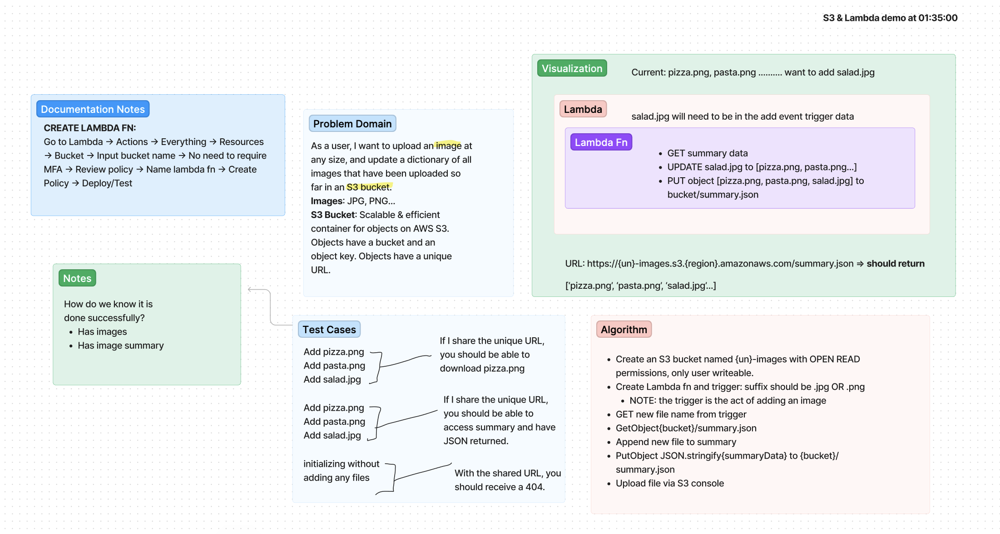

# LAB - Class 17

Project: S3 & Lambda

Author: Andra Steele

**Links and Resources**

[ci/cd](https://github.com/asteele1493/image-lambda/actions)

**Tests**

npm test

**UML**

Updated 02/03:

Whiteboard needs updated code for updated bucket policy, lambda role policy, and bucket code.

In your README.md include:
a description of how to use your lambda.
a description of any issues you encountered during deployment of this lambda.
a link to your images.json file.