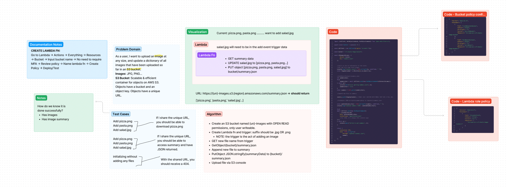

# LAB - Class 17

Project: S3 & Lambda

Author: Andra Steele

**Links and Resources**

[ci/cd](https://github.com/asteele1493/image-lambda/actions)

**UML**

Updated 02/05:

[Link to summary.json file](https://cf-steele-image-bucket.s3.us-west-2.amazonaws.com/summary.json)

## Issues during deployment

- Managing IAM roles assigned to user. Needed to adjust from root admin account as permissions increased with the lab.

- Ensuring the summary.json file was publicly accessible

- Manually changing the JSON file for my Lambda role. Had some unfortunate typos and took forever to troubleshoot.

- Not as big of an issue, but having to set up test events after leaving lab for a day.

- Interacting with the console was a big blocker in terms of trying to find exact places for things. Especially in terms of adjusting Lambda configurations versus IAM configurations versus S3 configurations.